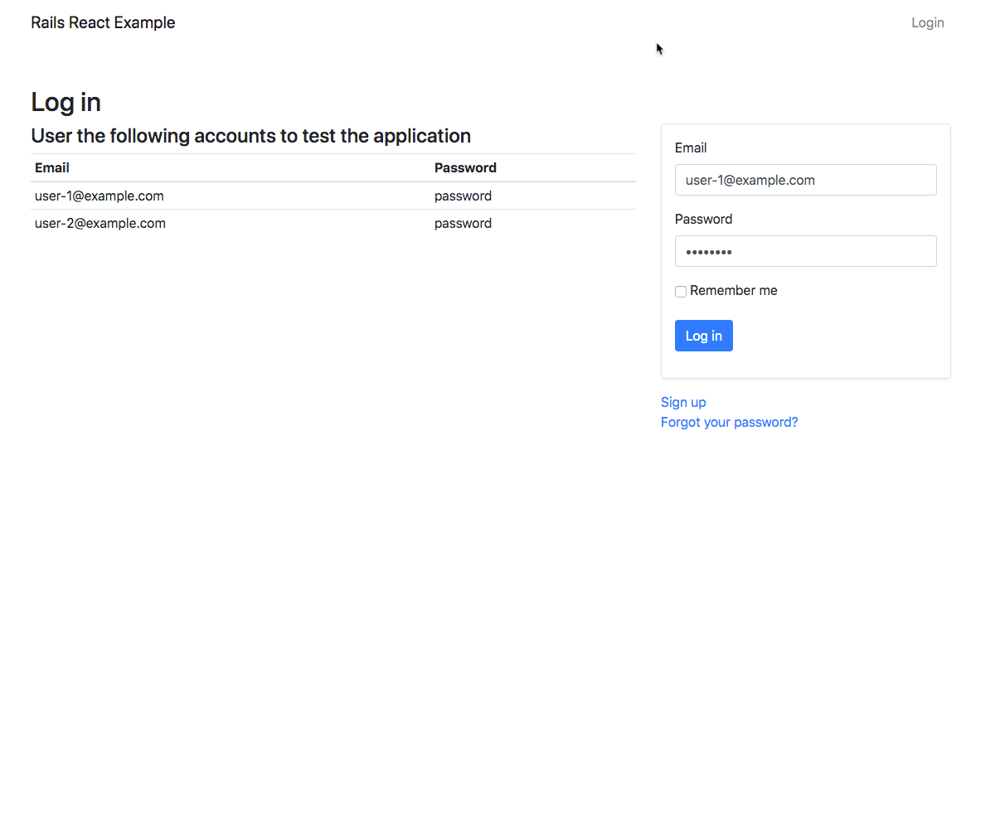

# Rails React Example

An example application built with Rails and React. See a [live demo](https://rails-react-example.herokuapp.com/).



## Local Build

```
bundle install
yarn install
rails db:create
rails db:seed
rails s
```

## Tests

```
rspec
```

## Specs

```
rspec f -d
```

## To Do

-   [ ] Highlight invalid field elements
